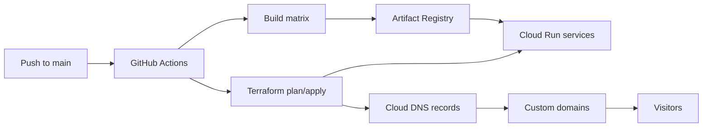

# Theo's Web Hub & Micro-Tools

Monorepo for the web properties behind `theoboursy.fr`: a personal portfolio, small project pages and web tools, plus the Terraform infrastructure that deploys them on Google Cloud.

The project avoids traditional bucket hosting. Each site is packaged into a tiny Go binary, deployed as an independent Cloud Run service, and mapped to its custom domain through Cloud DNS.

## What Is Inside

| Path | Purpose |
| --- | --- |
| [`www/`](www/) | Personal portfolio and resume site, served on `theoboursy.fr` and `www.theoboursy.fr`. |
| [`img2ascii/`](img2ascii/) | Static project page for the `img2ascii` image-to-ASCII tool, served on `ascii.theoboursy.fr`. |
| [`portfolio/`](portfolio/) | Project page summarizing this cloud-native IaC monorepo, served on `portfolio.theoboursy.fr`. |
| [`loadtest/`](loadtest/) | Project page for the `infra-loadtest` Scaleway load-testing platform, served on `loadtest.theoboursy.fr`. |
| [`monitoring/`](monitoring/) | Project page for the `infra-monitoring` cross-cloud Grafana platform, served on `monitoring.theoboursy.fr`. |
| [`dockeronline/`](dockeronline/) | Project page for the `M1_dockerOnline` self-service container platform, served on `dockeronline.theoboursy.fr`. |
| [`gopher/`](gopher/) | Project page for the `hall_of_gopher` Go image-gallery app, served on `gopher.theoboursy.fr`. |
| [`assets/`](assets/) | Shared assets (the common stylesheet) copied into every site image at build time; a site can override any file by shipping its own copy under `<site>/assets/`. |
| [`server/`](server/) | Shared Go static-file server using `embed.FS` to compile site assets into the binary. |
| [`IaC/`](IaC/) | Terraform configuration for Cloud Run v2, Cloud DNS, domain mappings and IAM. |
| [`.github/workflows/`](.github/workflows/) | GitHub Actions workflows for image builds and Terraform deployment. |
| [`Dockerfile`](Dockerfile) | Multi-stage Docker build that selects a site with `--build-arg SITE=<site>`. |

## Architecture



### Runtime

- **Backend:** one generic Go HTTP server reused by every static app.
- **Assets:** `index.html`, `404.html` and `assets/` are embedded at build time with `embed.FS`.
- **Images:** multi-stage Docker builds compile a static Go binary and run it from `scratch`.
- **Serving:** unknown paths return the embedded custom `404.html`.
- **Port:** Cloud Run and local containers serve on `8080`.

### Infrastructure

- **Cloud Run v2:** one service per app declared in [`IaC/config.json`](IaC/config.json).
- **Cloud DNS:** apex domains get Google-hosted A/AAAA records; subdomains get CNAME records to `ghs.googlehosted.com`.
- **Domain mappings:** Terraform maps each FQDN to the matching Cloud Run service.
- **IAM:** sites are public via `roles/run.invoker` for `allUsers`.
- **State:** Terraform uses a GCS backend configured at `terraform init`.

### CI/CD

- [`build.yml`](.github/workflows/build.yml) builds and pushes one container image per site to Artifact Registry.
- [`deploy.yml`](.github/workflows/deploy.yml) runs Terraform plan, uploads the plan artifact and applies it after manual approval.
- Authentication uses Google Workload Identity Federation through GitHub OIDC, so no long-lived GCP service account key is required.
- Images are tagged with both `github.sha` and `latest`; Terraform deploys the immutable `github.sha` tag.

## Apps And Domains

Apps are configured in [`IaC/config.json`](IaC/config.json):

| App | Site directory | Cloud Run service | Domains |
| --- | --- | --- | --- |
| Portfolio | `www/` | `theoboursy-www` | `theoboursy.fr`, `www.theoboursy.fr` |
| img2ascii | `img2ascii/` | `theoboursy-ascii` | `ascii.theoboursy.fr` |
| Portfolio (IaC) | `portfolio/` | `theoboursy-portfolio` | `portfolio.theoboursy.fr` |
| Load test | `loadtest/` | `theoboursy-loadtest` | `loadtest.theoboursy.fr` |
| Monitoring | `monitoring/` | `theoboursy-monitoring` | `monitoring.theoboursy.fr` |
| Docker Online | `dockeronline/` | `theoboursy-dockeronline` | `dockeronline.theoboursy.fr` |
| Hall of Gopher | `gopher/` | `theoboursy-gopher` | `gopher.theoboursy.fr` |

## FinOps Notes

The infrastructure is tuned for very low operational cost:

- `min_instance_count = 0` lets services scale to zero when idle.
- `max_instance_count = 2` caps unexpected scale-out.
- `cpu_idle = true` reduces CPU allocation while requests are not being processed.
- `startup_cpu_boost = true` improves cold-start behavior for the small Go runtime.
- Containers run with `128Mi` memory and a single static binary.

For current personal-site traffic, this setup is designed to stay within the Google Cloud free tier.

## Deployment

Deployment is intended to run from GitHub Actions.

Required GitHub environment variables:

| Variable | Description |
| --- | --- |
| `PROJECT_ID` | GCP project ID. |
| `REGION` | GCP region, for example `europe-west1`. |
| `DOMAIN` | Apex domain, for example `theoboursy.fr`. |
| `DNS_ZONE_NAME` | Existing Cloud DNS managed zone name. |
| `AR_REPO` | Artifact Registry repository name. |
| `TFSTATE_BUCKET` | Existing GCS bucket used for Terraform state. |
| `WORKLOAD_IDENTITY_PROVIDER` | GitHub OIDC Workload Identity provider. |
| `SERVICE_ACCOUNT` | GCP service account used by CI/CD. |
| `APPROVERS` | GitHub usernames allowed to approve Terraform apply. |

One-time resources expected to exist before the workflows run:

- GCP project.
- Artifact Registry repository.
- GCS bucket for Terraform state.
- Cloud DNS managed zone.
- Workload Identity Federation provider.
- Deployment service account with the required Cloud Run, DNS, IAM and Artifact Registry permissions.

## Terraform

Manual Terraform usage, when needed:

```sh
cd IaC
terraform init \
  -backend-config="bucket=<TFSTATE_BUCKET>" \
  -backend-config="prefix=infra"
terraform plan
```

Terraform variables can be passed with `TF_VAR_*` environment variables, matching the GitHub workflow:

```sh
export TF_VAR_project_id="<PROJECT_ID>"
export TF_VAR_region="europe-west1"
export TF_VAR_domain="<YOUR_DOMAIN>"
export TF_VAR_dns_zone_name="<YOUR_DNS_ZONE_NAME>"
export TF_VAR_image_tag="<IMAGE_TAG>"
```

## Adding A New Site

1. Create a new site directory with:
   - `index.html`
   - `404.html`
   - `assets/`
2. Add the site to the build matrix in [`.github/workflows/build.yml`](.github/workflows/build.yml).
3. Add the Cloud Run service and domain bindings to [`IaC/config.json`](IaC/config.json).
4. Push to `main` and let GitHub Actions build the image and run Terraform.

Example app entry:

```json
{
  "name": "theoboursy-newtool",
  "image_url": "europe-west1-docker.pkg.dev/theoboursy-fr/web/theoboursy-newtool",
  "subdomains": ["newtool"]
}
```

## Design Goals

- Keep each app isolated at the Cloud Run service level.
- Reuse one small, auditable server implementation.
- Avoid storing static GCP credentials in GitHub.
- Keep infrastructure declarative and reproducible.
- Preserve free-tier-friendly scaling and resource limits.
